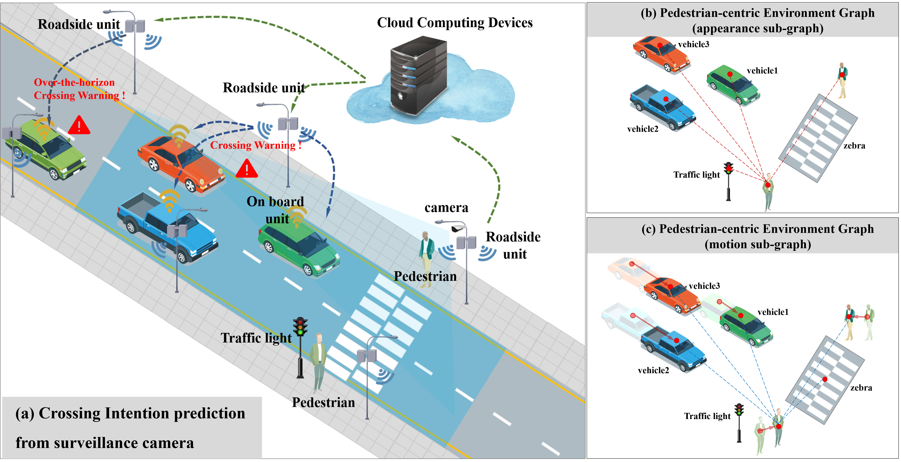

# Pedestrian-Crossing-Intention-Prediction-from-Surveillance-Videos

### Simple Introduction 

This  repository is built to share our paper submitted to IEEE T-TITS and the potentially publicized dataset for pedestrian crossing prediction from surveillance videos.  The introduction of this paper  is as  follows:

>  Pedestrian crossing intention prediction could effectively prevent traffic injuries and improve pedestrian safety. This paper focuses on pedestrian crossing intention prediction from surveillance cameras, which could provide over-the-horizon safety warnings and has the potential to better ensure pedestrian safety, compared with that from on-board cameras. However, most prediction-based methods are designed with a fundamental assumption that the visual data is collected from an on-board camera rather than a bird-eye-view one, thus the prevalent methods in this research domain do not match surveillance scenarios. To deal with this issue, an automated learning framework is proposed, in which a pedestrian-centric environment graph is primarily constructed to reflect visual variations and spatiotemporal relationships between the pedestrian and its surroundings. After that, a Graph Convolutional Network (GCN) based environment encoder and a pedestrian-state encoder are designed to extract prominent environment features and pedestrian behavior features, respectively. Finally, an intention prediction decoder is developed to extrapolate the probability of crossing intention. Experimental results demonstrate that each component in the framework contributes to performance improvement and their combination obtains the state-of-the-art performance, suggesting the effectiveness and superiority of our framework.

### Data Download

The dataset used in this study (i.e., surveillance video) is provided by the local public security department, which involves a lot of privacy (such as license plate, face, etc.), we are considering erasing the privacy and making the data public, but currently we do not have the permission of the local public security department. If possible later, we will publicize the dataset at this repository. Also, the access to the code of model implementation will be found in the linked code repository after being well-organized and standardized. We appreciate your interest in our work.

